# Asteroid Classification
**Author**: Laura Miller

# Overview

Asteroids are rocky bodies that come in a variety of sizes, ranging from just a few meters to hundreds of kilometers in diameter. Although the chance of a particular asteroid impacting the earth in the short term is quite low, a major impact is inevitable on the scale of millenia. We are all familiar with the asteroid impact that caused a global extinction event in the Middle Miocene period about 16 million years ago. Thankfully, these events seem to occur on a 26 million year cycle. The main poster child of planetary defense is the Tsunguska Event of 1908, in which a 10,000 metric ton asteroid exploded over Sibera, Russia with the energy of 2,000 Hiroshima-sized nuclear weapons. The Tsunguska Event is a better example of the types of impacts we may have to contend with in the near future. An updated understanding of Tsunguska and other events has inspired modern efforts to detect and track potentially hazardous asteroids.  

Methods that are currently being studied for impact mitigation include:
- Gravity tractor: spacecraft or device will fly alongside the asteroid in order to pull it off Earth's path using gravity.
- Kinetic impactor: one or more large, high-speed spacecraft will deflect the asteroid into a different trajectory.
- Blast deflection: launch a nuclear explosive (or other kind) to disrupt, deflect, or destroy a near earth asteroid.

Any one of these impact-response plans would require sufficient preparation and execution time (up to 20 years or more), so early detection is key. The result of this project is a Random Forest classification model with a high recall score that can help flag potentially hazardous asteroids based on their various characteristics.

# Business Problem

NASA's NEO Observations Program sponsors projects related to planetary defense and is tasked with finding, tracking, and characterizing NEOs. Classification models can flag potentially hazardous asteroids as updates are made to the MPC (Minor Planet Center) so that the CNEOS (Center for Near-Earth Object Studies) can implement timely follow-up studies, tracking their orbits and analyzing their possible future positions relative to Earth. A classification model should prioritize recall/sensitivity for the positive class to ensure that any asteroid that is truly potentially hazardous is properly identified.

# Data

The specific dataset for this project came from Kaggle (https://www.kaggle.com/sakhawat18/asteroid-dataset) and was sourced from the JPL Small-Body Database Search Engine (https://ssd.jpl.nasa.gov/sbdb_query.cgi). The cleaned dataset contains:
- 921,430 rows/ asteroid entries
- 44 features, including dummy variables 

### Basic Column Definition
- **SPK-ID**: Object primary SPK-ID
- **Object ID**: Object internal database ID
- **Object fullname**: Object full name/designation. Combination of provisional and permanent designation. Some asteroids do not yet have a permanent designation.
- **pdes**: Object primary designation (most recent designation). Provisional designation or permanent designation (if available). When a new object is found that cannot be identified with an already-known object, Minor Planet Center (MPC) assigns a provisional designation- year of discovery, two letters, and further digits if needed (eg. 1989 AC). When orbit is well enough determined, object is assigned permanent designation- a number. https://web.archive.org/web/20060216182947/http://www.iau.org/MINOR_PLANETS_NAMING.245.0.html   
- **name**: Object IAU name. Discoverer is invited to suggest a name only after object receives permanent designation.
- **NEO**: Near-Earth Object (NEO) flag
- **PHA**: Potentially Hazardous Asteroid (PHA) flag. Target.
- **H**: Absolute magnitude parameter. Visual magnitude an observer would record if the asteroid were placed 1 Astronomical Unit (au) away, and 1 au from the Sun and at a zero phase angle (the magnitude of an asteroid at zero phase angle and at unit heliocentric and geocentric distances)
- **Diameter**: object diameter (from equivalent sphere) km Unit
- **Albedo**: Geometric albedo. Shininess/reflectiveness of the surface. https://www.nasa.gov/mission_pages/WISE/multimedia/gallery/neowise/pia14733.html
- **Diameter_sigma**: 1-sigma uncertainty in object diameter km Unit
- **Orbit_id**: Orbit solution ID
- **Epoch**: Epoch of osculation in modified Julian day form
- **Equinox**: Equinox of reference frame
- **e**: Orbit eccentricity. Amount by which orbit deviates from a perfect circle (0 - circular, 0 to 1 - elliptic, 1 - parabolic escape, < 1 - hyperbola 
- **a**: Semi-major axis au Unit. One half of the major axis of the elliptical orbit; also the mean distance from the Sun
- **q**: perihelion distance au Unit. Perihelion is orbit’s closest point to the Sun
- **i**: inclination; angle with respect to x-y ecliptic plane
- **tp**: Time of perihelion passage TDB Unit. The time at which an object is closest to the sun.
- **moid_ld**: Earth Minimum Orbit Intersection Distance au Unit. Distance between closest points of orbits of asteroid and Earth. Direct measure of close approach/collision risk.
- **class**: orbit classification

#### Orbit Classifications

- AMO	Amor:	Near-Earth asteroid orbits similar to that of 1221 Amor (a > 1.0 AU; 1.017 AU < q < 1.3 AU).
- APO	Apollo:	Near-Earth asteroid orbits which cross the Earth's orbit similar to that of 1862 Apollo (a > 1.0 AU; q < 1.017 AU).
- AST	Asteroid:	Asteroid orbit not matching any defined orbit class.
- ATE	Aten:	Near-Earth asteroid orbits similar to that of 2062 Aten (a < 1.0 AU; Q > 0.983 AU).
- CEN	Centaur:	Objects with orbits between Jupiter and Neptune (5.5 AU < a < 30.1 AU).
- HYA	Hyperbolic Asteroid:   Asteroids on hyperbolic orbits (e > 1.0).
- IEO	Interior Earth Object:   An asteroid orbit contained entirely within the orbit of the Earth (Q < 0.983 AU).
- IMB	Inner Main-belt Asteroid:   Asteroids with orbital elements constrained by (a < 2.0 AU; q > 1.666 AU).
- MBA	Main-belt Asteroid:   Asteroids with orbital elements constrained by (2.0 AU < a < 3.2 AU; q > 1.666 AU).
- MCA	Mars-crossing Asteroid:   Asteroids that cross the orbit of Mars constrained by (1.3 AU < q < 1.666 AU; a < 3.2 AU).
- OMB	Outer Main-belt Asteroid:   Asteroids with orbital elements constrained by (3.2 AU < a < 4.6 AU).
- PAA	Parabolic Asteroid:   Asteroids on parabolic orbits (e = 1.0).
- TJN	Jupiter Trojan:   Asteroids traped in Jupiter's L4/L5 Lagrange points (4.6 AU < a < 5.5 AU; e < 0.3).
- TNO	TransNeptunian Object:   Objects with orbits outside Neptune (a > 30.1 AU).

#### Additional notes
- The astronomical unit (au) is defined by the IAU as exactly 149,597,870,700 m. Based on avg distance between Earth and Sun.
- NEO: An asteroid or comet with a perihelion distance less than or equal to 1.3 AU. 99% of NEOs are asteroids. 
- 1 sigma uncertainty means 1 standard deviation.

# Data Cleaning/Scrubbing

### Missing values

There were 4 missing values for `neo`. The proper flags were imputed based on the asteroid's perihelion distance, as asteroids with q, or perihelion distance <= 1.3 AU are near earth objects.

ID columns, uninformative columns, and columns with 800K+ missing values were dropped.

- ID columns/unique identifiers: `id`, `spkid`, `full_name`, `pdes`, `name`
- Uninformative: `equinox`, `orbit_id` (`class` contains orbit information but in broader categories, so `orbit_id` is not needed).
- 800K+ missing: `diameter`, `diameter_sigma`, `albedo`

Any remaining rows with null values were then dropped. Some entries were missing ~19922 values in multiple columns, but this meant losing only ~0.20% of the data.

### Categorical columns

`neo` and `pha` flags were changed from N/Y to 0/1.

Dummy variables were created for the `class` feature (12 classes total).

# EDA

#### Orbit Class Distribution

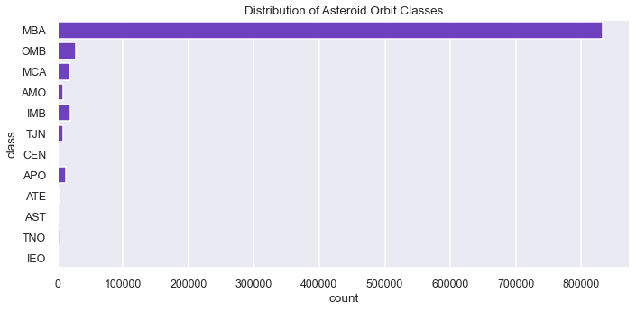

Most asteroids are main belt asteroids (MBA), which have orbital elements constrained by 2.0 AU < a < 3.2 AU; q > 1.666 AU. They are within the asteroid belt, orbiting between Mars and Jupiter. The fewest asteroids are IE0 (interior earth objects), which have orbits contained within the orbit of earth (q < 0.983 AU).

#### Potentially hazardous & NEO orbit classes

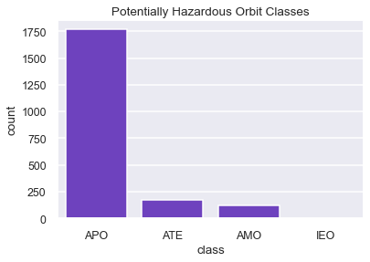

These four orbit classes that contain potentially hazardous asteroids are also the orbit classes that contain NEOs. Most potentially hazardous asteroids are of the APO (Apollo) class (Near-Earth asteroid orbits which cross the Earth's orbit similar to that of 1862 Apollo (a > 1.0 AU; q < 1.017 AU).

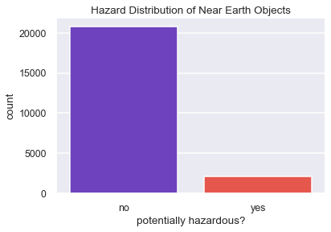

Most NEOs are non-hazardous (90%) while 9% of NEOs are potentially hazardous. All potentially hazardous asteroids are NEOs, but not all NEOs are potentially hazardous.

#### Semi-major axis (`a`) and perihelion distance (`q`)

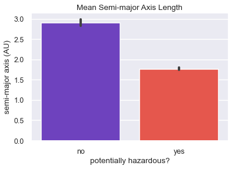

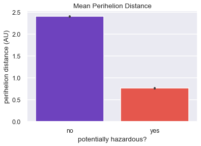

The semi-major axis is half the width of the ellipse that defines an orbit, while the perihelion is an orbit's closest point to the sun. Potentially hazardous asteroids are near-earth objects with smaller orbits than other asteroids, so it makes sense that their `q` and `a` values would be smaller on average.

#### Orbit eccentricity

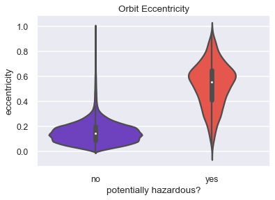

The bulk of potentially hazardous asteroids have more elliptic orbits than non-hazardous asteroids. For objects of comparable size within the same orbit class/constraints, the body with the more elliptic orbit can be moving at higher velocities as it crosses its perihelion, via Kepler's 2nd law. Higher velocities mean a more devastating potential impact with Earth.

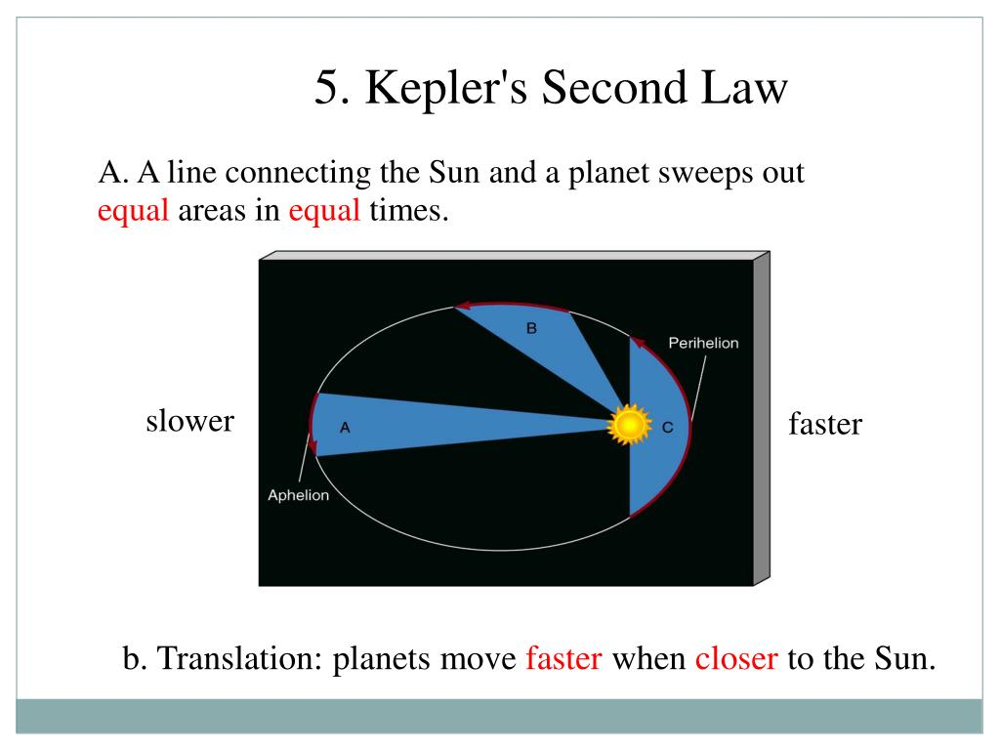

A line connecting the sun and the orbit will sweep out equal areas in equal time. Compared to a body with a more cicular orbit, a body on an elliptic orbit will be moving faster as it gets closer to the sun due to the orbit's tighter curves. 

# Modeling

Attempted classification models:
- Logistic Regression
- Decision Tree
- Random Forest

## Logistic Regression

The last dummy variable for `class` was dropped as part of an additional preprocessing step for logistic regression.
The baseline model was overfit to the training data, due to using SMOTE to address class imbalance. Adjusting the `class_weight` parameter instead of using SMOTE seemed to address overfitting. Outliers were removed from the features with the heighest weights in Iteration 2, and the cleaned dataframe from this step was used in the tree-based models. A multicolinearity check revealed that many features were highly correlated with each other, with most pairs having correlation above 0.94. Removal of these features along with outliers improved model performance slightly.

#### Best performing logistic regression model: Iteration 5

Params:

- `solver` = 'liblinear'
- `C` = 1e25
- `max_iter` = 1000
- `class_weight` = {0:1, 1:100}

Classification reports (train and test data):

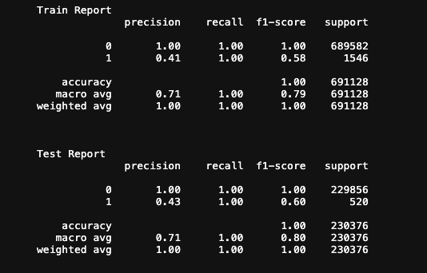

Confusion matrix:

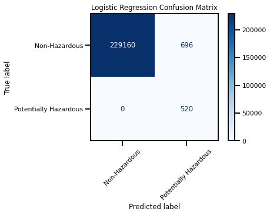

After comparing Iteration 5 (no outliers or overfitting) with a baseline decision tree, it was clear that logistic regression was not going to be the best-performaing model for this dataset. Although logistic regression reached a score of 1.00 for recall, precision and F1 were low in comparison. Also, the confusion matrix showed 696 false positives. It was likely that tuning the decision tree could bring recall for the positive class to a similar score with fewer false positives. 

## Decision Tree

The data used for the tree models omitted outliers in the highest-weighted features from the logistic regression model. Standard scaling was included in the pipeline for each iteration, which shifted the feature means to 0 with a standard deviation of 1. The baseline model was overfit and had a `max_depth` of 18. Iterations 2-4 implemented tree pruning by searching for `max_depth` values less than 18 as well as larger values for `min_samples_leaf` and `min_samples_split` while prioritizing recall (`True Positives / (True Positives + False Negatives)`). The objective here was to correctly identify as many asteroids that are truly potentially hazardous as possible, i.e. minimize false negatives. At Iteration 4, continuing to gridsearch while prioritizing recall only increased the number of false positives (non-hazardous asteroids misclassified as potentially hazardous) with no benefit to recall. Therefore, Iteration 3 was the best decision tree.

#### Best performing decision tree: Iteration 3

Best params:

- `class_weight` = 'balanced`
- `max_depth` = 4
- `min_samples_leaf` = 7
- `min_samples_split` = 2

Classification reports (train and test data):

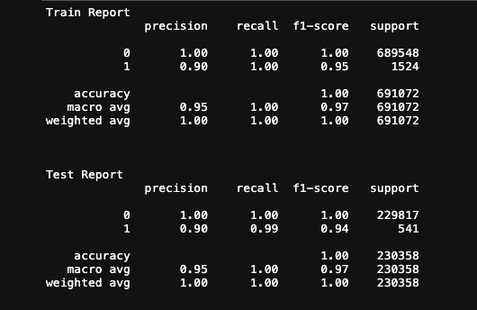

Confusion matrix:

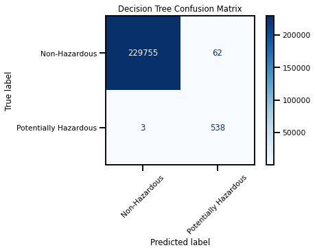

Feature importances:

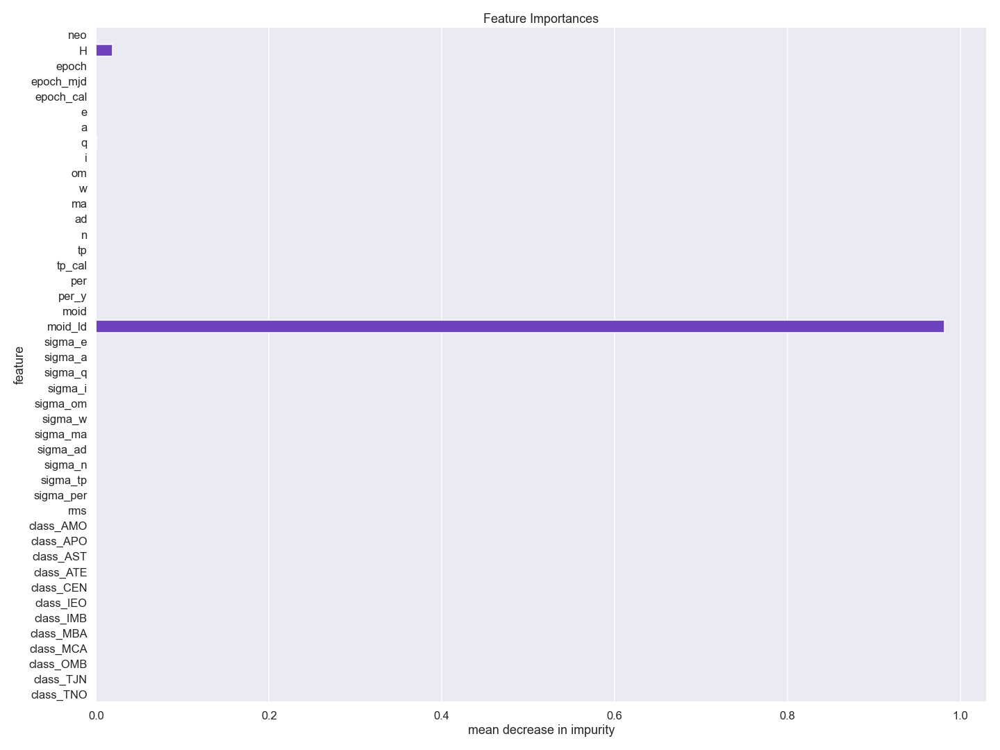

`H` and `moid_ld` are the only features that seem to have a real signal on this plot. 

Tree:

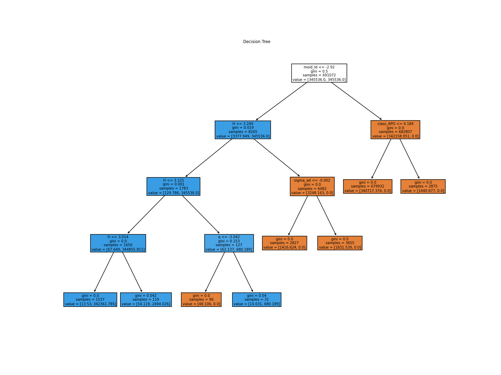

## Random Forest

Random forest was the best performing model for this dataset. Standard scaling was performed on the data prior to instantiating any random forests. The overfit baseline model had a mean `max_depth` of 27, so values less than 27 were gridsearched along with `class_weight` and `min_samples_leaf` in the iterations to follow. `min_samples_split` = 2 was used for all iterations because this was the best value from the decision tree gridsearches (it is also the lowest possible value), and one one expect the trees in a random forest to be more grown out than a single decision tree model. Iteration 3 showed the same recall score for the positive class as Iteration 2, but the number of false positives increased from 97 to 489. Like with the decision tree, continuing to gridsearch with lower values for `max_depth` seemed to reduce precision with no increase in recall. Iteration 4 omitted `max_depth` = 6, the lowest value, in order to grow out the trees and help address the high number of false positives. Iteration 4 was the best-performing iteration.

#### Best performing Random Forest: Iteration 4

Best params:

- `class_weight` = {0:1, 1:200}
- `max_depth` = 7
- `min_samples_leaf` = 3
- `min_samples_split` = 2

Classification reports (train and test data):

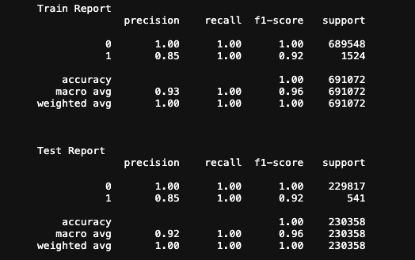

Confusion matrix:

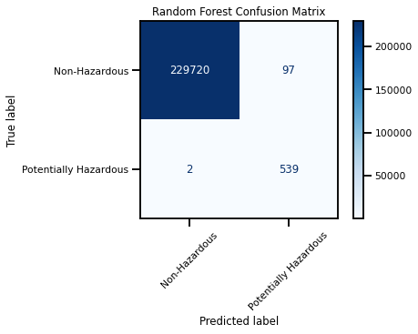

Feature importances:

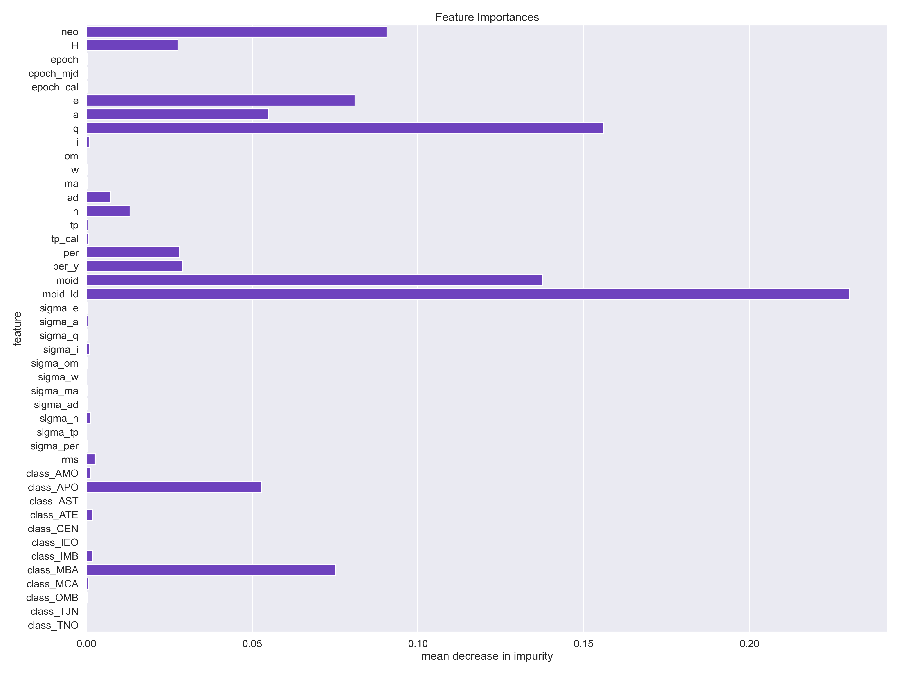

The best parameters for the random forest make for more grown out trees than the single decision tree, as expected. The classification report shows macro avg scores of 0.92 for precision (`True Positives/ Total Predicted Positives`) and F1 (harmonic mean of precision and recall). The most important metric was recall, and this had a value of 1.00 overall as well as 1.00 for the positive class. The confusion matrix shows that the model missed only 2 potentially hazardous asteroids (~0.4%) while misclassifying 97 non-hazardous asteroids. Correctly classifying as many phas as possible and minimizing false negatives was the main objective of model tuning, even at the cost of more false positives. Though the chance of a single unflagged pha impacting the earth is quite small, the potential consequences of that impact would be dire. 

# Conclusions & future work

Random forest was the best performing model for this dataset with recall scores of 1.00 overall (macro avg) and for the positive class). A concrete business recommendation would be to track any asteroid that has a positive flag (potentially hazardous). If NASA predicts that a body will be on a crash course towards Earth, strategies for deflection should be developed and enacted in a timely fashion. We need only to change such an asteroid's timing by 6 minutes. 

The model can be improved as updates are made to the data held by the JPL Small-Body Database. For example, there were 800K+ missing values for `albedo` and `diameter`. If more data were to be gathered on the physical properties of these asteroids, like `albedo`, `albedo` and `H` could be used to estimate `diameter` and more potentially useful features could be included in the training of a classification model. Also, the addition of more asteroids with known labels could only help.

# Sources

Background

- https://www.nasa.gov/planetarydefense/neoo
- https://www.nature.com/articles/srep37055
- https://www.airuniversity.af.edu/Portals/10/ASPJ/journals/Chronicles/france2.pdf

Images

- Kepler's 2nd law: https://www.slideserve.com/arva/kepler-s-laws
- Orbit eccentricity: https://astronomy.swin.edu.au/cosmos/O/Orbital+Eccentricity
